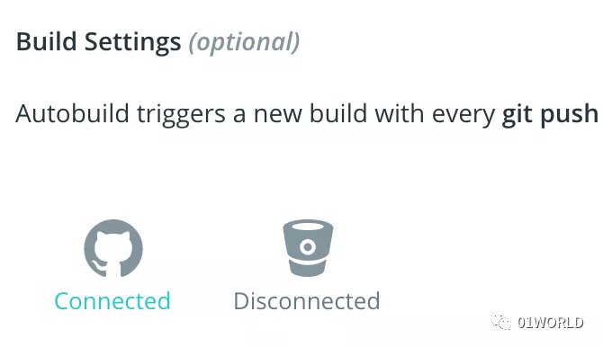
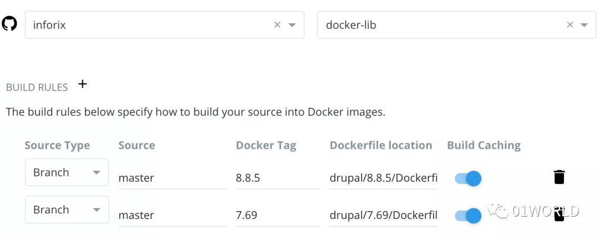
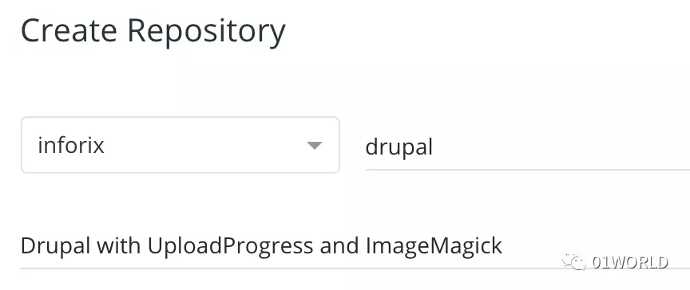
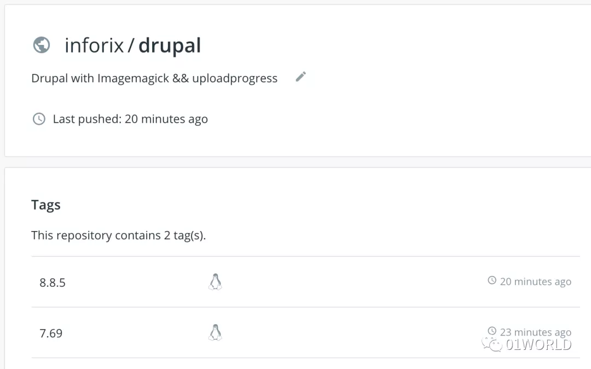

今天张老师问到有些国外的Docker镜像访问起来比较困难怎么办？这为我云原生的系列文章掀开了新的篇章。在接下来的文章中，我将逐步介绍云原生的来龙去脉，以及相关实践。这将涵盖运维的事情，也将涵盖开发的事情，更将涉及高层设计的俯视感问题。

今天的主题，需要您已经有以下内容：

- Docker Hub上的帐户
- GitHub上的帐户
- 私有Docker Repository（可选）

部署私有Docker Repository主要是为了提高镜像拉取速度。当然，如果您有国外的VPN，那么您可以忽略本篇文章。

## GitHub上创建Repository

在进行Kubernetes实战时，官方文章里经常提到一个Docker镜像：**k8s.gcr.io/echoserver:1.10**，这个镜像是无法直接访问的。为了能够使用这些镜像，我们需要在GitHub中创建一个Repository，譬如我自己的https://github.com/inforix/docker-lib，该库主要是一些常用的Docker，目前我里面放了两个Drupal镜像制作文件Dockerfile。之所以自己制作Dockerfile，是因为官方的Drupal仅仅就是Drupal核心代码，而一个正常的Drupal网站需要UploadProgress、ImageMagick等组件，这就需要自己制作了。

我制作的Drupal镜像路径结构为：

```plain
/drupal
   /8.8
       Dockerfile
   /7.69
       Dockerfile
```

## 在Docker Hub上自动构建

有了GitHub上的Dockerfile，接下来在Docker Hub中启用自动构建镜像。

目前Docker Hub支持GitHub和BitBucket上的Dockerfile。在创建Repository的界面中，拉到底部的Build Settings部分，如下图，我已近关联了GitHub账户，两者之间是通过OAuth2.0协议来授权访问的，本来也都是公开的Repository，所以非常方便。



点击GitHub的图标，出现下图所示的界面。

选择用户，再选择Repository，本例中为docker-lib。

我同时制作了两个Dockerfile，分别为8.8.5和7.69，因此需要添加两个BUILD RULES。

- Source，也就是主分支Master
- Docker Tag，也就是构建后的镜像Tag
- Dockerfile location，两个Dockerfile所在的位置



别忘了刚开始的设置。


Repository Name

然后单击底部的Create & Build按钮就可以让Docker Hub为你自己创建了。

下图是创建完成的界面：



如果要使用该镜像，直接运行下面的命令即可：

```shell
docker pull inforix/drupal:8.8.5
```

**是不是很方便？**

## 重点在于此

重点在于Dockerfile怎么写。譬如在国内访问k8s.gcr.io/echoserver:1.10比较困难，那么您可以新建一个echoserver的目录，在其中创建一个Dockerfile：

```Dockerfile
FROM k8s.gcr.io/echoserver:1.10
```

然后，经过第一部分的操作，您就可以直接使用自己的镜像了：

```shell
docker pull inforix/echoserver:1.10
```

如果您有自己的私有Repository，那么可以建立Proxy类型的中继，这样就可以更快的访问Docker Hub上的镜像了。

**是不是非常方便？**