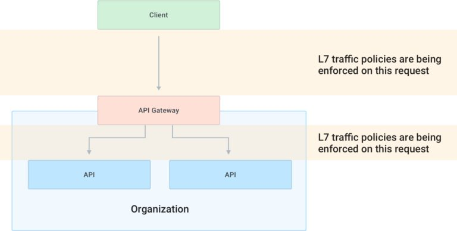
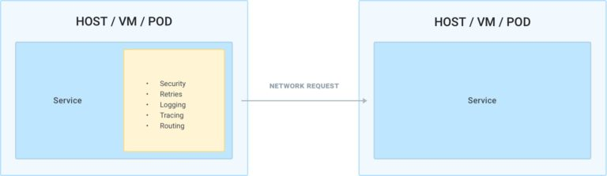
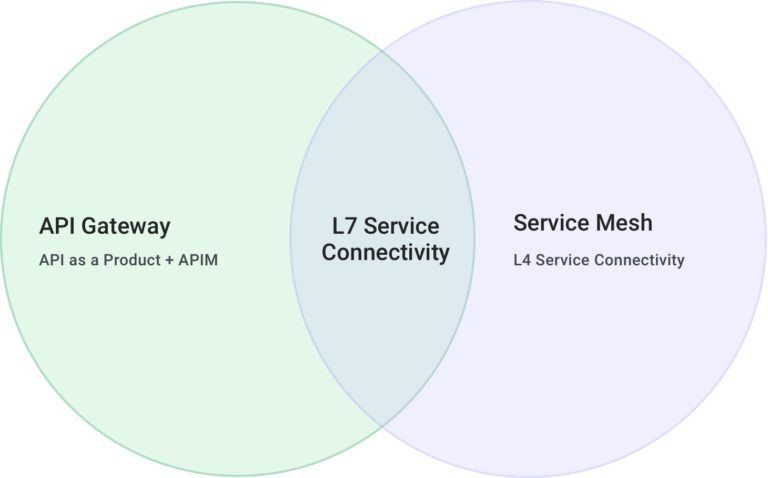
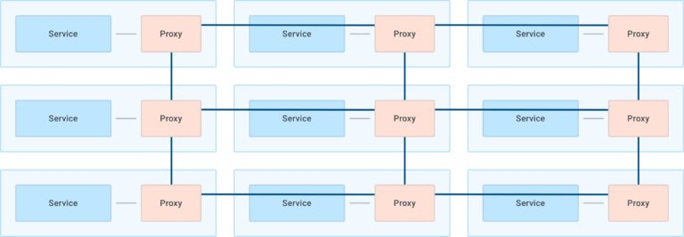

API Gateway和Service Mesh因其处理的都是微服务的内容，而且字面上的功能都有重叠，具备服务发现、熔断、超时等高级功能，所以容易引起混淆。本篇就来讲述一下这其中的区别。

本文的很多图片都来自于KONG的一篇文章：https://konghq.com/blog/the-difference-between-api-gateways-and-service-mesh/

## 功能区别

API Gateway的主要目的是将微服务作为被管理的API暴露（给外部系统），它连接了外部系统和内部服务。

Service Mesh是一个网络通信基础设施，可以用于将应用层的网络通信功能从你的服务代码中剥离出来。

## 方向视角下的区别

借助于防火墙的南北向、东西向的概念，我们可以将API Gateway视为解决南北向问题的产物，而Service Mesh则是微服务内部解决东西向问题的产物。

## 网络模型下的区别

API Gateway工作在第7层应用层；Service Mesh工作在第4层传输层和第7层应用层。两者之间在第7层有重叠，故而有相似之处。

## 实现方式的区别

API Gateway一般作为独立的产品存在，尽管有KONG、tyk等产品，但基本的理念是建立在反向代理基础上的功能叠加。

Service Mesh则一般作为微服务单元的前端代理，与微服务单元伴生，微服务之间的沟通交由这些前端代理负责。

