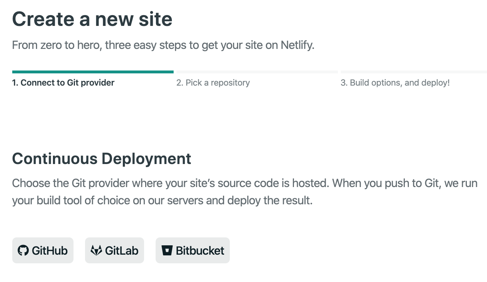

昨天写GitHub与Docker Hub集成时，顺便了解到了Netlify与GitHub的集成。恰好最近也在想重新整一个静态网站，一是微信公众号毕竟更多的是讨论生活，不讨论技术；二是想翻阅以前的文章太难了，所以就想重整一个网站。前几日申请了01world.info域名，恰好可以借助于GitLab和Netlify一起做静态网站。

另外，之所以写这个帖子，还是希望引起大家注意国外信息化的动向之一：自动化DevOps渗透到各个领域。

## Netlify是什么？

Netlify是一家新兴公司，成立于2014年，位于旧金山。他主要为Web应用程序和静态网站提供托管和无服务器后端服务，并且是基于CDN提供服务。它的核心亮点在于通过Git自动部署网站，并且提供全球就近最快访问。而这些都是用户无需额外操作的，只要在GitHub上授权Netlify访问你的网站项目即可。

Netlify提供免费和收费两种服务模式，对于个人用的静态网站，免费的即可。

## Hugo是什么？

Hugo是由Go语言实现的静态网站生成器。它简单、易用、高效、易扩展、快速部署。最大的亮点在我看来就两个：

- 足够简单，不像其他语言系的静态网站生成器，有这依赖，那依赖的。
- 足够快。生成一个网站非常快，至于多快，我也无法形容。

## 如何创建静态网站

创建一个静态网站的大体步骤如下：

1. 在GitHub上创建一个Repository。
2. 在本地安装Hugo命令，按照官方文档操作即可，非常简单。通过Hugo命令创建新的站点

```shell
hugo new site 01world
```

3. 安装一个主题，并提交代码到GitHub上的Repository。
4. 在Netlify上注册账户，并创建一个站点。



点击其中的`GitHub`，会弹出对话框提示你授权Netlify访问你的某个Repository，构建工具选择默认的hugo，然后就可以开始构建了。

5. 构建完成，你就可以访问你的网站了。
6. 如果你有自己的域名，还可以修改域名指向，或者让netlify为你解析DNS，这样它又可以帮你去LetEncrypts申请SSL证书了。

**好自动！好省事！**

## 启示

再一次，让我觉得路漫漫其修远兮。开放、融合、汇聚，这么简单的术语，看起来实现也不难，技术还是那些陈词滥调的技术，但是他们确实那么易用。
